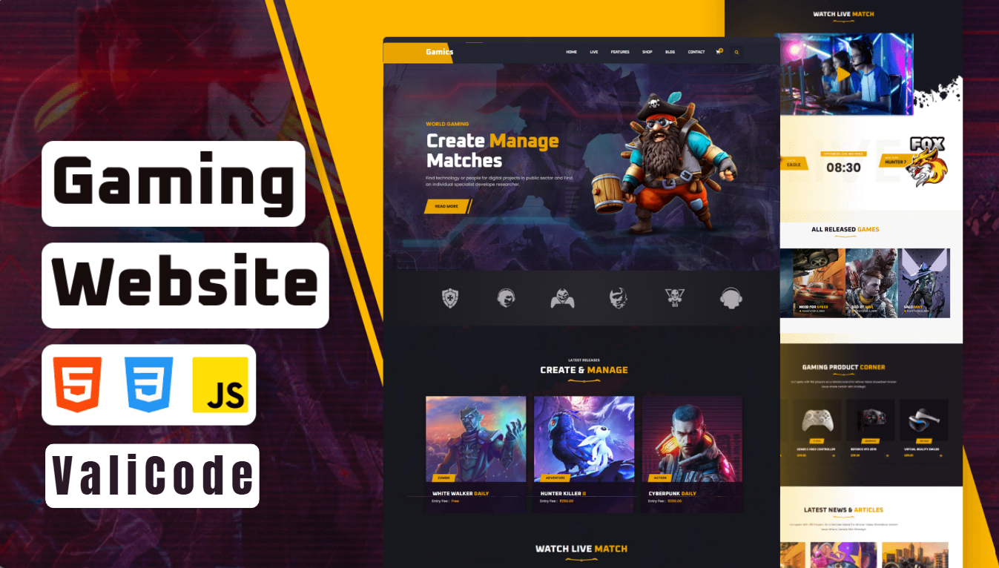

# 🎮 Gamics - Create & Manage Matches | Gaming Website 🚀  

Welcome to **Gamics**, your ultimate destination for **creating and managing gaming matches**! Whether you're a **hardcore eSports enthusiast** or just love **competitive gaming**, this platform has everything you need!  

## 🌟 Features  
✅ **Create & manage matches** effortlessly 🎯  
✅ **Watch live tournaments & gameplay** 🎥🔥  
✅ **Discover the latest game releases** 🚀🎮  
✅ **Connect with the gaming community** 🤝💬  
✅ **Responsive & modern UI** for a seamless experience 💻  

## 📌 Live Matches, Latest Game Releases & More!  
Join **Gamics** and **level up your gaming experience!** 🕹️🚀  

## 🛠️ Technologies Used  
- **HTML5** 🏗️  
- **CSS3** 🎨  
- **JavaScript (ES6+)** ⚡   

## 🔗 Preview

## 🎯 Contribution
Want to contribute? 🚀

## Fork the repo 🍴
1. Create a new branch (feature-newFeature) 🌱
2. Commit your changes (git commit -m "Added new feature") 💾
3. Push to the branch (git push origin feature-newFeature) 🚀
4. Open a Pull Request ✅

## 📜 License
This project is open-source under the MIT License.

## 🎮 Connect With Us!
💬 Follow & Join the Gaming Community:
🔗 Twitter: @ValiCodeLab
🔗 GitHub: shivamgpt812

🔥 Don't forget to ⭐ this repo if you like it! 🚀

